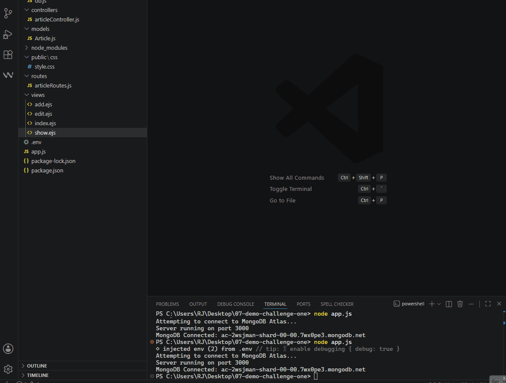
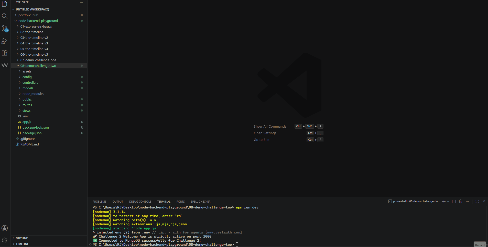
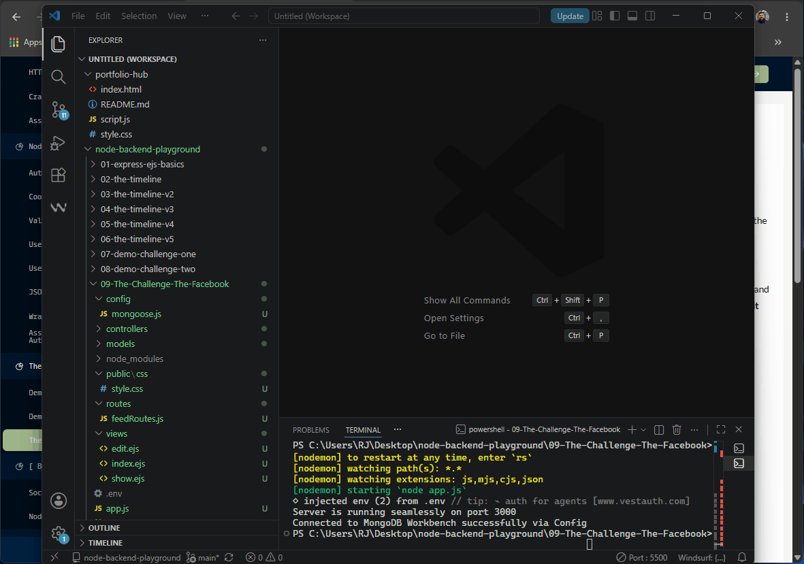
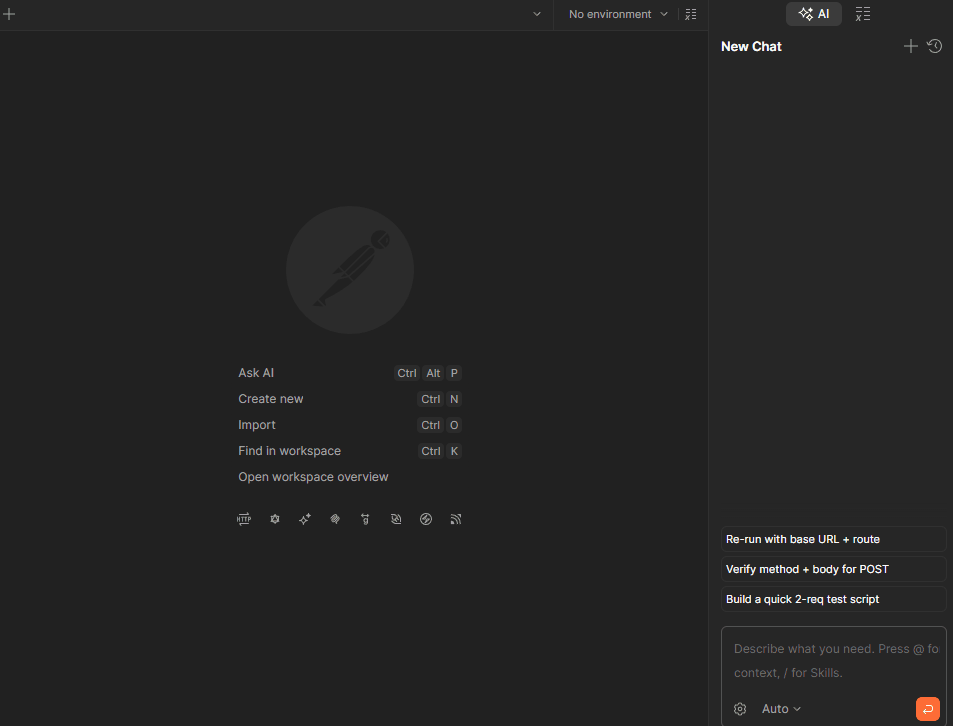
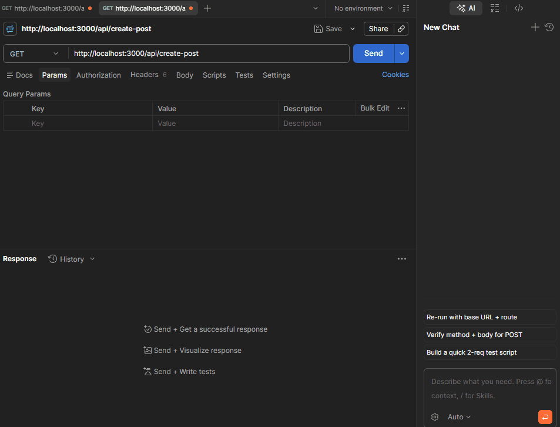

# Node.js & ExpressJS Backend Playground

📎 **Architectural Ecosystem Status:**


Welcome to my personal backend development repository. This repository documents my journey in mastering server-side architecture, RESTful routing, MVC design patterns, and database integrations using Express.js and MongoDB.

---

## 🏛️ MVC Core Data Architecture Flow

To maintain high security, data isolation, and smooth state transitions across all full-stack endpoints, the routing execution sequence inside this playground adheres strictly to the following structural MVC flow chart:

```text
       [ Client Browser / Postman Operations ]
                         │
              (HTTP Request: GET / POST)
                         ▼
               [ Express Router Tree ] ──(Middleware: Auth/.env Verification)──► [ Access Denied (400/401) ]
                         │
                  (Valid Route Path)
                         ▼
               [ Controller Business Logic ]
                    │              ▲
         (Mongoose DB Write)   (Data Document Returns)
                    ▼              │
           [ Mongoose Models ] ◄──► [ MongoDB Atlas Cloud Cluster ]
```           

## 📂 Repository Structure

The project is highly organized into isolated, scalable modules to prevent code clutter and ensure clear separation of concerns:

* **`01-express-ejs-basics/`** Contains early architectural concepts, chainable route handlers, custom middlewares (including Morgan logger), static file serving, and the implementation of EJS template layout partials.
* **`02-the-timeline/`** *Assignment 1 Setup.* A full-stack mockup of a social network feed that utilizes a dynamic sorting algorithm to display user messages in a strict chronological order (most recent on top).
* **`03-the-timeline-v2/`** *Assignment 2 Setup.* An evolution of the timeline project implementing a full **Model-View-Controller (MVC)** architecture integrated with a cloud database (**MongoDB Atlas**).
* **`04-the-timeline-v3/`** *Assignment 3 Setup.* An advanced iteration focusing on multi-model relationships, introducing the comments feature under individual posts alongside robust validation and dynamic rendering.
* **`05-the-timeline-v4/`** *Assignment 4 Setup.* A complete transition into a modern headless **RESTful API Engine**. This architecture decouples the frontend entirely, exposing data endpoints designed for Postman validation and future React integration.
* **`06-the-timeline-v5/`** *Assignment 5 Setup (Production Milestone).* Re-integrating the front-end views into a highly secure, full-stack MVC application. Engineered a strict session infrastructure backed by encrypted authentication tokens and persistent user state controls.
* **`07-demo-challenge-one/`** *Demo Challenge 1.* A complete Full-Stack MVC application with strict backend validation, isolated EJS views, and MongoDB Atlas cloud integration.
* **`08-demo-challenge-two/`** *Demo Challenge 2.* A secure, highly-tuned Welcome App engineered using full-stack Node.js MVC architecture, custom routing pipelines, encrypted database storage, and fluid UI interfaces.
* **`09-The-Challenge-The-Facebook/`** *The Facebook Challenge.* A production-grade server-side micro-platform strictly enforcing MVC architecture, standalone custom routing paths, automated client deletion checks, and strict database field length restrictions.

---

## 🚀 Key Features in Version 2 (03-the-timeline-v2)

This upgraded version introduces robust backend functionalities and full CRUD operations:
* **Cloud Database Integration:** Connected seamlessly to MongoDB Atlas using Mongoose ODM to persist post data permanently in the cloud ☁️.
* **Full CRUD Capabilities:** Users can now **Create** new posts, **Read** the dynamic timeline feed, view single post details, **Update** existing post content, and **Delete** posts permanently 🛠️.
* **Data Validation:** Strict backend validation rules ensuring that any created or edited post must be a minimum of 25 characters long before saving 🛑.
* **Modernized UI Style:** Fully customized the edit and details view (`details.ejs`) to perfectly match the sleek GitHub-inspired dark theme (Matrix Connect) used in the main timeline page 🖤.

---

## 🚀 Key Features in Version 3 (04-the-timeline-v3)

This version expands the core relational capabilities of the MVC timeline application:
* **Relational Data Modeling:** Implemented a secondary `Comment` schema with full ObjectId references mapping directly back to parent posts.
* **Granular Backend Validation:** Enforced distinct structural requirements for inputs, requiring a 25-character minimum for posts and a 10-character minimum for user comments.
* **Cascading Depletions:** Structured controller workflows to ensure that removing a specific post programmatically deletes all nested comments attached to it.

---

## 🚀 Key Features in Version 4 (05-the-timeline-v4)

This upgraded version implements strict REST specifications and professional backend guidelines:
* **Headless API Architecture:** Replaced legacy UI renderings with pure JSON responses (`res.json()`) to act as a standalone data provider.
* **Complete CRUD Endpoints:** Engineered production-ready routing pipelines to fully manage posts and sub-resource comments via structured HTTP operations.
* **HTTP Status Code Mapping:** Integrated precise semantic evaluation response states (`200 OK`, `201 Created`, `400 Bad Request`, `404 Not Found`) to standardize error and lifecycle states.
* **Postman Integration:** Fully traced and verified all validation pipelines, payload requests, and routing parameters using Postman client testing collections.

---

## 🔐 Key Features in Version 5 (06-the-timeline-v5)

This production-grade milestone introduces state-of-the-art security practices and full-stack session architectures:
* **JSON Web Token (JWT) Authentication:** Secured the ecosystem using signed JWTs stored inside protected HTTP-Only cookies to handle state memory and session lifecycles.
* **Granular Ownership & Middleware Walls:** Integrated custom interceptors (`requireAuth`, `checkUser`) to securely prevent unauthenticated operations and lock updating/deletion capabilities to the authentic document creator.
* **Virtual Populate Optimization:** Advanced data fetching using Mongoose Virtual Populate parameters to fetch post-associated sub-resource comments dynamically without hardcoding relational models.
* **Environment Configuration (.env):** Isolated sensitive server variables, cluster credentials, and encryption secret keys out of the code base using Dotenv structures to meet standard dev guidelines.
* **UX Continuity Control:** Integrated browser scroll layout memory configurations to guarantee client-side position persistence across dynamic validation lifecycle updates.

---

## ⚡ Demo Challenge 1: NYT MVC Architecture (07-demo-challenge-one)

This module encapsulates a production-ready Full-Stack application engineered with explicit backend isolation controls, server-side data sanitation pipelines, and global cloud database persistence.

### 🛠️ Core Engineering Implementations:
* **Strict Server Validation Walls:** Enforced rigorous payload inspection checking structural query constraints before collection injection.
* **Decoupled MVC Partial Views:** Isolated independent structural interface nodes utilizing custom embedded layouts.
* **Atlas Cluster Orchestration:** Integrated dynamic cloud connection handlers managing remote MongoDB endpoints.

### 🎬 Live Execution Verification Log
<details>
<summary>🎬 <b>Click to view NYT MVC Application Cycle</b></summary>
<br>

</details>

---

## ⚡ Demo Challenge 2: Welcome App MVC (08-demo-challenge-two)

This module encapsulates a production-ready Full-Stack Welcome Application built entirely from scratch. It follows a strict **Model-View-Controller (MVC)** design pattern, integrating robust server-side input validation and dynamic session memory control.

### 🛠️ Core Engineering Implementations:
* **Strict Server Validation Walls:** Enforced rigorous payload inspection checking data constraints before database injection (First Name $\le$ 10 chars, Last Name $\le$ 15 chars, and non-empty parameters).
* **Decoupled MVC Architecture:** Complete structural separation separating concerns across dedicated `models/`, `views/`, `controllers/`, and `routes/` modules.
* **Encrypted Authentication Pipeline:** Integrated server-side `bcrypt` automatic pre-save hooks to hash and salt user credentials instantly inside the local collection.
* **Cookie-Backed Session Persistence:** Configured dynamic `cookie-parser` session infrastructure using protected HTTP-Only client storage to handle user state redirects and view permissions securely.
* **Sleek UX/UI Modernization:** Modernized the application wireframe layout into an elegant, side-by-side balanced grid utilizing a highly fluid Minimalist Glassmorphism theme to guarantee seamless navigation.

### 🎬 Live Execution Verification Log
<details>
<summary>🎬 <b>Click to view Welcome App MVC Application Cycle</b></summary>
<br>

</details>

---

## 🏆 Final Section Challenge: The Facebook MVC (09-The-Challenge-The-Facebook)

This production-grade module wraps the definitive backend challenge for the MVC full-stack segment, enforcing strict architecture guidelines and user flow criteria.

### 🛠️ Core Engineering Implementations:
* **Strict Server Validation Walls:** Enforces rigid input rules on data storage (Name $\le$ 15 characters, Message $\le$ 40 characters) and prevents blank entries.
* **Precise Route Layout Matching:** Tailored custom HTTP endpoints (`/feed`, `/feed/:id`, `/feed/edit/:id`) to mirror requested specification wireframes exactly.
* **Asynchronous UX Protection Layers:** Built client-side native confirm prompts on delete requests to prevent unintentional collection wipes.
* **Isolated Resource Directory**: Extracted styling configurations into standalone CSS structures and isolated remote database connections into an independent configurations helper.

### 🎬 Live Execution Verification Log
<details>
<summary>🎬 <b>Click to view The Facebook MVC Full Execution Cycle</b></summary>
<br>

</details>

---

## 📡 RESTful API Specifications & Endpoints (Version 4)

### 📝 Posts API
| HTTP Method | API Endpoint | Description | Expected Status Codes |
| :--- | :--- | :--- | :--- |
| **GET** | `/api/get-posts` | Fetches all timeline posts in a reverse chronological sequence. | `200 OK`, `500 Error` |
| **POST** | `/api/create-post` | Submits a single new timeline post. Enforces a 25-character minimum constraint. | `201 Created`, `400 Error` |
| **PUT** | `/api/edit-post/:id` | Modifies the core string content of an existing post by its database ID. | `200 OK`, `400 Error`, `404 Not Found` |
| **DELETE** | `/api/delete-post/:id` | Permanently drops a post and cascaded comments from the collections. | `200 OK`, `404 Not Found` |

### 💬 Comments API
| HTTP Method | API Endpoint | Description | Expected Status Codes |
| :--- | :--- | :--- | :--- |
| **GET** | `/api/get-post-comments/:postId` | Pulls all comments associated with a specific target post ID (Oldest First). | `200 OK`, `404 Not Found` |
| **POST** | `/api/post-post-comment/:postId` | Creates and logs a new comment sub-resource under a valid parent post ID. | `201 Created`, `400 Error`, `404 Not Found` |

### 📊 Automated API Testing Demonstration (Postman)

Below are the live interactive verification tests executed locally on the server engine to validate routing consistency and precise semantic status responses.

<details>
<summary>📸 <b>Click to view Live Postman Verification Logs (GET & POST)</b></summary>
<br>

#### 1️⃣ Fetching Database Documents (`GET /api/get-posts`) -> Status: `200 OK`


#### 2️⃣ Submitting New Content Record (`POST /api/create-post`) -> Status: `201 Created`

</details>

---

## 🛠️ Tech Stack & Dependencies

* **Runtime Environment:** Node.js
* **Backend Framework:** Express.js
* **Database & ODM:** MongoDB & Mongoose
* **Data Transmission:** Pure JSON Payloads (v4) & Dynamic EJS Renderings (v5 & Challenges Full-Stack)
* **Authentication Infrastructure:** JSON Web Tokens (JWT), Cookie-Parser & Bcrypt Hashing
* **Testing Pipeline:** Postman API Client
* **Development Tools:** Morgan (HTTP Request Logger), Nodemon, Dotenv, Method-Override

---

## 🌐 Live Cloud Demonstration

Before running the code locally, you can instantly test and view the final production-ready stage:
* 🌍 **Live Production Web Application (Version 5):** [Launch Live Timeline App 🚀](https://timeline-api-v4.onrender.com)

---

## 💻 Local Execution & Verification
If you want to inspect or execute any specific evolution stage locally, navigate to the repository root directory and run the standalone command for your desired module:

```bash
# Option 1: Run Module 1 (Basics)
cd 01-express-ejs-basics && npm install && npm run dev

# Option 2: Run Module 2 (The Timeline Assignment 1)
cd 02-the-timeline && npm install && npm run dev

# Option 3: Run Module 3 (The Timeline v2 with DB)
cd 03-the-timeline-v2 && npm install && npm run dev

# Option 4: Run Module 4 (The Timeline v3 Comments & Isolation)
cd 04-the-timeline-v3 && npm install && npm run dev

# Option 5: Run Module 5 (The Timeline API v4 Headless Engine)
cd 05-the-timeline-v4 && npm install && npm run dev

# Option 6: Run Module 6 (The Timeline v5 Full-Stack Secure JWT Milestone)
cd 06-the-timeline-v5 && npm install && npm run dev

# Option 7: Run Module 7 (Demo Challenge 1: NYT MVC Architecture)
cd 07-demo-challenge-one && npm install && npm run dev

# Option 8: Run Module 8 (Demo Challenge 2: Welcome App MVC)
cd 08-demo-challenge-two && npm install && npm run dev

# Option 9: Run Module 9 (The Facebook MVC Challenge)
cd 09-The-Challenge-The-Facebook && npm install && npm run dev

💡 Note: After running any module, remember to return to the root directory (cd ..) if you want to switch modules. Access your local environment at:
👉 http://localhost:3000
```

*Engineered by Raji Al-Abdullah - 2026*